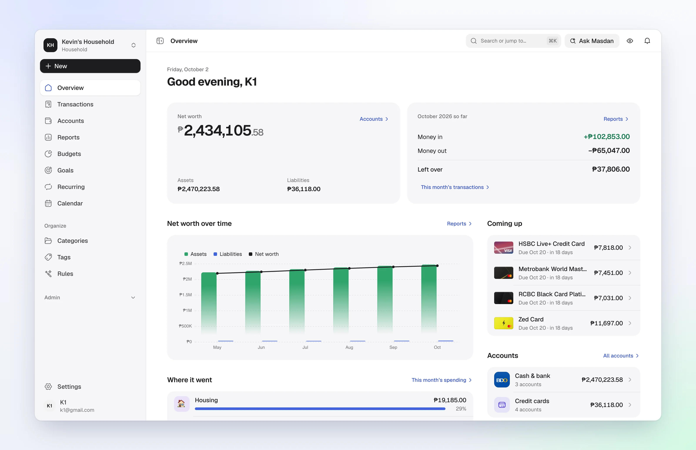
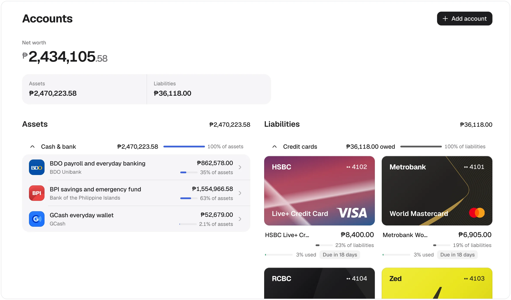
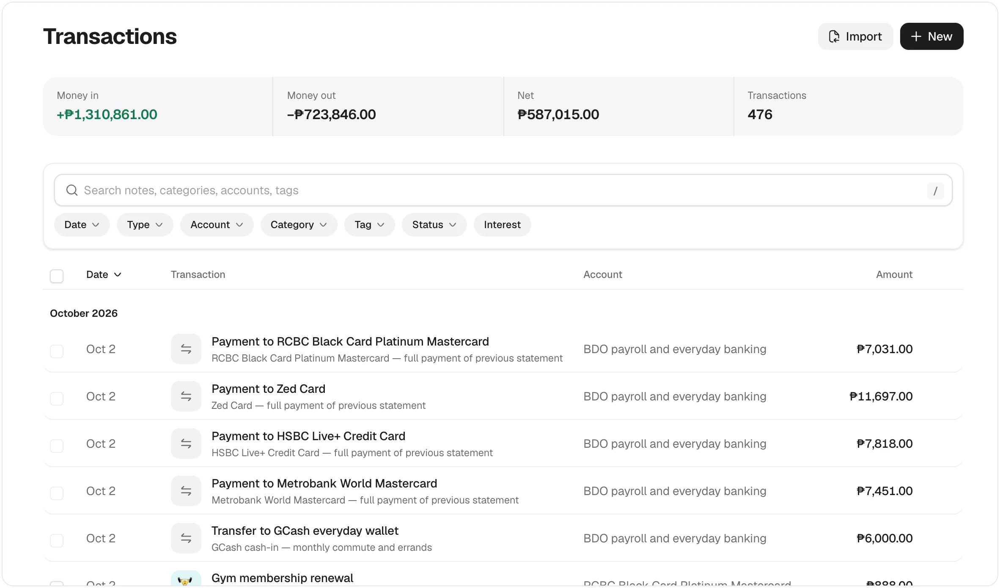
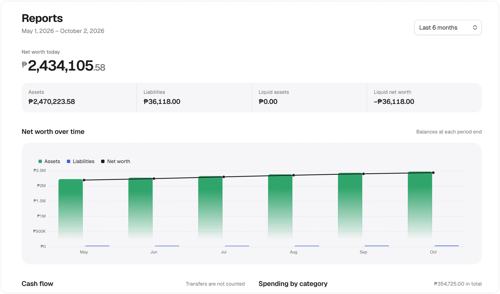
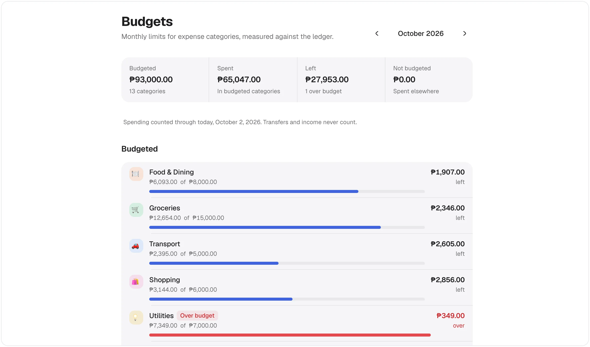

<div align="center">


# Masdan

**Look closely at your money: where it is, and where it went.**

Every account, card, bill and budget in one shared ledger, on a server you own.

[](LICENSE) [](docs/self-hosting.md) [](docs/self-hosting.md#requirements) [](CONTRIBUTING.md)

[**Get started**](#getting-started) · [Features](#features) · [Self-hosting guide](docs/self-hosting.md) · [FAQ](#faq) · [Contributing](CONTRIBUTING.md)

</div>

<br />

<picture>
  <source media="(prefers-color-scheme: dark)" srcset="docs/images/dashboard-dark.webp" />
  
</picture>

<br />

> **masdan** · _Tagalog, verb._ From _masid_, careful observation. To look at something carefully, with full attention.

Bank apps, card statements, a spreadsheet, a drawer of receipts. Masdan puts every account, card, bill, budget and goal into one ledger the household shares, so the whole picture is one screen away. Every member records into the same books, and balances, budgets and reports are derived from it, never typed in twice.

## Features

<table>
  <tr>
    <td width="50%" valign="top">
      <h3>Accounts</h3>
      <p>Assets and liabilities in any currency. Credit cards that look like the real thing, with statements, utilization and net-worth history.</p>
      <picture>
        <source media="(prefers-color-scheme: dark)" srcset="docs/images/accounts-dark.webp" />
        
      </picture>
    </td>
    <td width="50%" valign="top">
      <h3>Ledger</h3>
      <p>Income, expenses and transfers with splits, tags, attachments and recurring schedules. CSV in, CSV out.</p>
      <picture>
        <source media="(prefers-color-scheme: dark)" srcset="docs/images/transactions-dark.webp" />
        
      </picture>
    </td>
  </tr>
  <tr>
    <td width="50%" valign="top">
      <h3>Reports</h3>
      <p>Cash flow, category spending, savings rate and budget performance, all read from the ledger.</p>
      <picture>
        <source media="(prefers-color-scheme: dark)" srcset="docs/images/reports-dark.webp" />
        
      </picture>
    </td>
    <td width="50%" valign="top">
      <h3>Planning</h3>
      <p>Category budgets, savings goals, card reminders and a bill calendar any calendar app can subscribe to.</p>
      <picture>
        <source media="(prefers-color-scheme: dark)" srcset="docs/images/budgets-dark.webp" />
        
      </picture>
    </td>
  </tr>
</table>

**And the rest of it:**

- **Built for a household.** Members share accounts, with roles and permissions, link-based invitations, and an admin console for whoever runs the server.
- **Assistance, if you want it.** Quick entry from free text, receipt photos or Telegram, AI categorization and Ask Masdan. All optional, and every AI call is capped per household per day.
- **Yours to keep.** Export every record as CSV whenever you like. No bank connections and no email: invitations are links you hand over, and password recovery runs through an admin.
- **Light on infrastructure.** Postgres is the system of record. Redis and S3-compatible storage are optional, and the whole stack runs from one Docker Compose file.

## Getting started

You need Docker, Node 26 (`nvm use` reads `.nvmrc`) and pnpm 10+. Four commands from a clone to a running household:

```bash
git clone https://github.com/Klu-Digital/Masdan.git && cd Masdan
pnpm install && pnpm secrets:setup
docker compose up -d --wait postgres && pnpm db:deploy
pnpm docker:up
```

Then open **[http://localhost:2600](http://localhost:2600)** and create your account.

Rather not clone the repo? The [published images](docs/self-hosting.md#run-the-published-images) on Docker Hub run with nothing but Docker and one `compose.yaml`.

> [!IMPORTANT]
>
> The first account on a fresh instance becomes its admin, and sign-up closes behind it. Create yours before the instance is reachable by anyone else. Everyone after that joins through a household invite link.

From there, the **[self-hosting guide](docs/self-hosting.md)** covers deploying behind a proxy, storage for receipts, Redis, the AI features, the Telegram bot, and account recovery.

| Service | What it's for |
| --- | --- |
| **Postgres** (required) | The ledger, sessions and the job queue |
| Redis | Shared rate limits and caching |
| S3-compatible storage | Receipts and attachments |
| An AI provider | Quick entry, receipts, categorization and Ask Masdan |
| Telegram | Chat entry from your phone |

Want to look around before setting anything up? `pnpm dev` runs everything locally, and `pnpm db:seed` fills it with a demo household. See [CONTRIBUTING.md](CONTRIBUTING.md#setup).

## Built with

[React](https://react.dev) and [TanStack Router](https://tanstack.com/router) on the web, a [Hono](https://hono.dev) + [oRPC](https://orpc.unnoq.com) API, [better-auth](https://better-auth.com), [Drizzle](https://orm.drizzle.team) on [Postgres](https://www.postgresql.org), and [pg-boss](https://github.com/timgit/pg-boss) for background jobs. The UI is [coss ui](https://coss.com/ui) on Base UI and Tailwind. It all lives in one pnpm workspace.

## Documentation

| Read | For |
| --- | --- |
| [Self-hosting guide](docs/self-hosting.md) | Running, configuring and looking after an instance |
| [CONTRIBUTING.md](CONTRIBUTING.md) | Local setup, tests, scripts and conventions |
| [CONTEXT.md](CONTEXT.md) | What the product's words mean: household, ledger, posting, statement |
| [docs/adr/](docs/adr/) | Why the non-obvious decisions were made |
| [AGENTS.md](AGENTS.md) | The condensed briefing for coding agents |

Each part of the codebase keeps its own README beside the code, with the reasoning and the things that bite. CONTRIBUTING.md [links to all of them](CONTRIBUTING.md#layout).

## FAQ

<details>
<summary><b>Do I need to host it myself?</b></summary>
<br />

Yes. Masdan runs on your own infrastructure, and you manage updates and backups for your instance. [Getting started](#getting-started) takes four commands on one machine with Docker.

</details>

<details>
<summary><b>Does it connect directly to my bank?</b></summary>
<br />

No. You record transactions yourself, or import your bank's CSV export into the ledger.

</details>

<details>
<summary><b>Do I need AI to use Masdan?</b></summary>
<br />

No. AI features are optional, and Masdan works fully without an AI provider. If you enable them, the relevant data is sent to the provider you choose, which may cost money. Every household has a daily cap.

</details>

<details>
<summary><b>Will there be a mobile app?</b></summary>
<br />

No native app is planned. Masdan is a web app you use in your browser.

</details>

<details>
<summary><b>Will Masdan become a paid product?</b></summary>
<br />

There are no plans to monetize it. It's an open-source project, not a subscription business. Running your own instance may still have hosting costs.

</details>

<details>
<summary><b>Can I suggest a feature?</b></summary>
<br />

Absolutely. Open an [issue](https://github.com/Klu-Digital/Masdan/issues) describing what you're trying to do. We can talk it through and, if you'd like, build it together.

</details>

## Contributing

Issues and pull requests are welcome. [CONTRIBUTING.md](CONTRIBUTING.md) has setup, the test layout, and the conventions worth following. Adding credit cards or banks for your country is data-only work with [its own guide](packages/card-catalog/CONTRIBUTING.md).

## Acknowledgements

Masdan takes its inspiration from [Maybe](https://github.com/maybe-finance/maybe) and its community fork [Sure](https://github.com/we-promise/sure), the open-source, self-hosted personal finance apps. Thank you to the people behind both.

## License

[MIT](LICENSE). Read it, run it, change it.
